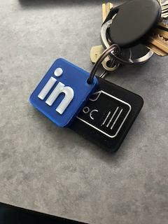
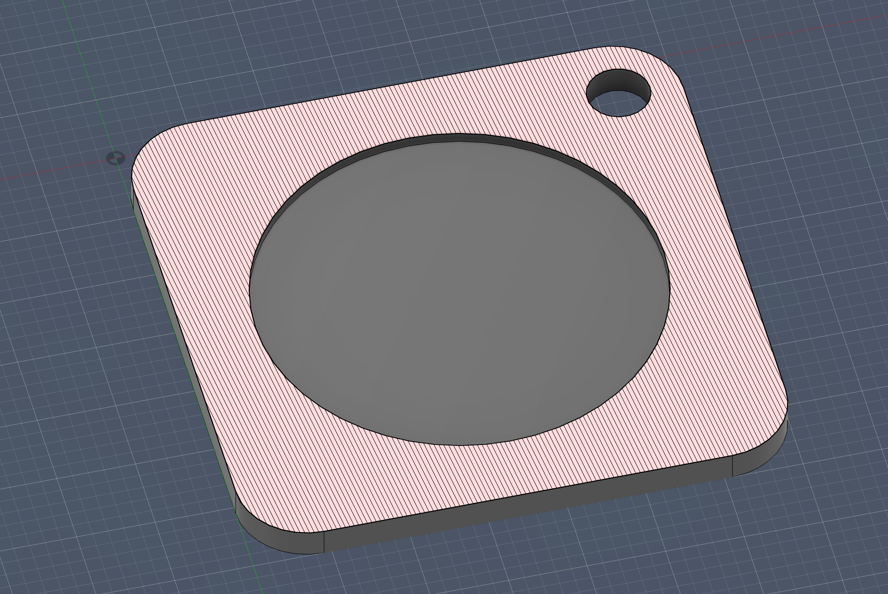
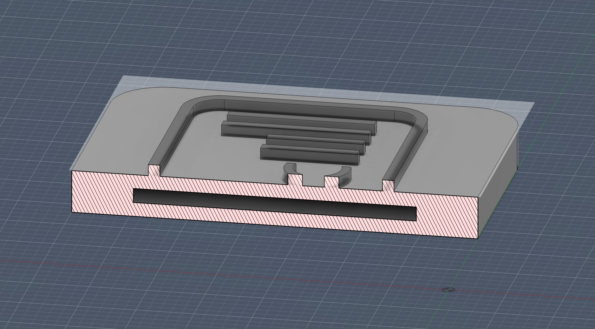
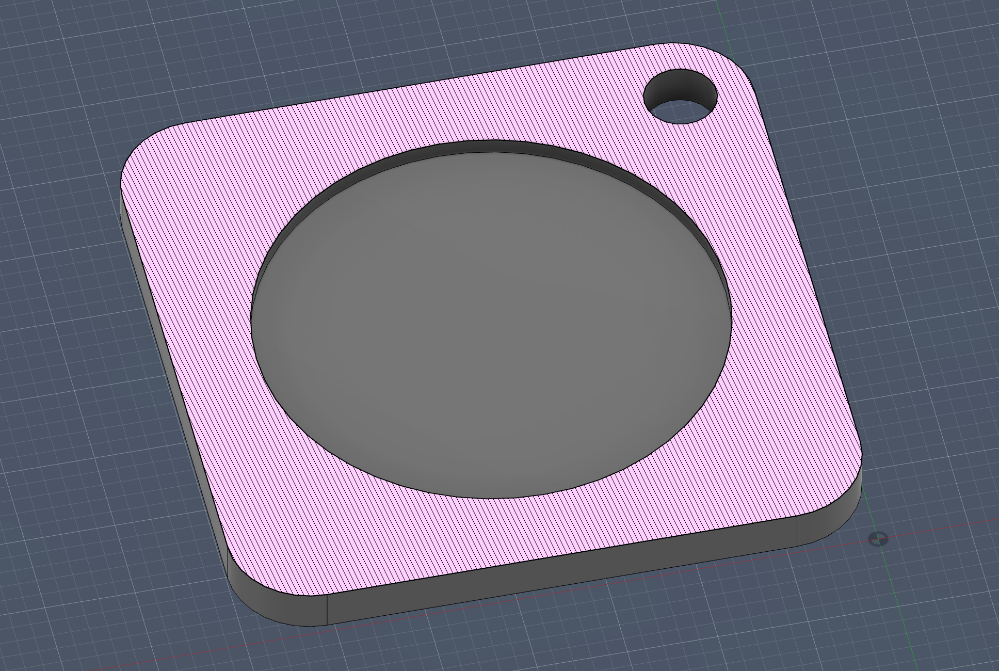
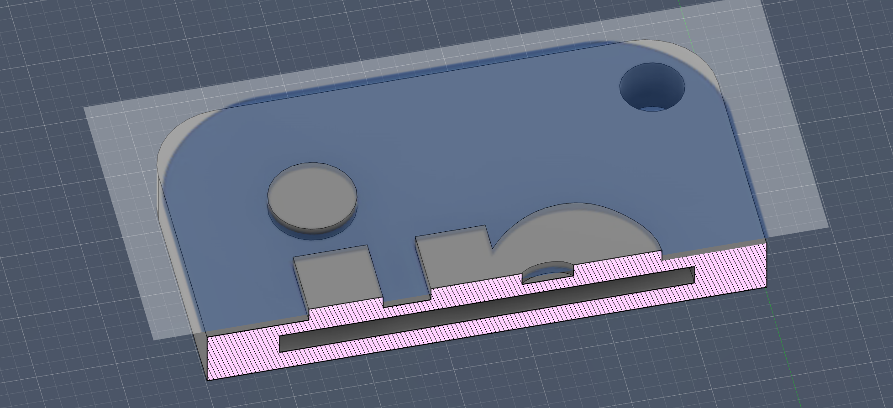
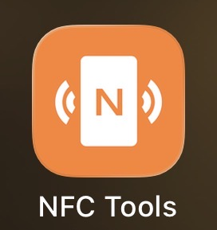

# 3D Printed NFC Resume Keychain

An open-source project that combines **3D printing and NFC technology** to create keychains that instantly open a **resume or LinkedIn profile** when tapped with a smartphone.

The idea came from wanting a simple way to share my resume and LinkedIn profile at networking events. Instead of asking someone to type a URL or search for a profile, they can simply **tap the keychain with their phone** and immediately access the information.

This project demonstrates:

- CAD modeling
- 3D printing
- NFC programming
- practical networking tools

---

## Example

---

## How It Works

Inside the 3D printed keychain is a small **NFC chip/tag** embedded during the printing process.

When someone taps their phone on the keychain:

- the **resume version** opens a PDF resume
- the **profile version** opens a LinkedIn profile

Most modern smartphones can read NFC tags without installing any additional app.

---

## Model Overview

### Resume NFC Tag

Cross section from top

Cross section from side

---

### LinkedIn Profile NFC Tag

Cross section from top

Cross section from side

---

## Printing and Assembly

The design contains a **slot inside the print for the NFC chip**.

### Workflow

1. Import the model into your slicer (PrusaSlicer, Cura, etc.).
2. Slice the model normally.
3. Add a **pause in the slicer at the layer where the NFC slot becomes open**.
4. When the printer pauses, place the NFC chip inside the slot.
5. Resume the print to seal the chip inside the keychain.

### Optional: Logo Color Change

You can also add a **second pause during slicing** to change filament color for the logo.

1. Add a pause at the layer where the logo begins.
2. Change filament color.
3. Resume the print.

This creates a clean two-color result without a multi-material printer.

---

## NFC Chips Used

The tags used for this project are small **NFC chips/tags** that can be programmed with a phone.

Example product:

https://www.amazon.com/dp/B087M9FLM4

These work well because they are:

- thin enough to embed in the print
- easy to program
- compatible with most smartphones

---

## Programming the NFC Tag

The NFC tags were programmed using the **NFC Tools** mobile app.

Any NFC writing app can be used, but NFC Tools provides a simple workflow.

### Example workflow

1. Open an NFC writing app (e.g., NFC Tools).
2. Select **Write**.
3. Add a **URL / URI record**.
4. Paste the link you want the tag to open (resume, LinkedIn, portfolio, etc.).
5. Write the record to the NFC tag.
6. Test the tag by tapping it with a smartphone.

---

## Files

Printable files are located in the `models` folder:

- [ResumeNFC.stl](models/ResumeNFC.stl)
- [ResumeNFC.3mf](models/ResumeNFC.3mf)
- [LinkedInNFC.stl](models/LinkedInNFC.stl)
- [LinkedInNFC.3mf](models/LinkedInNFC.3mf)

STL → universal compatibility  
3MF → modern format with more metadata

---

## License

This project is licensed under the **MIT License**.

---

## Trademark Notice

LinkedIn is a trademark of LinkedIn Corporation.

The LinkedIn name and logo shown in this repository are used only for demonstration purposes in a personal project. This project is not affiliated with, endorsed by, or sponsored by LinkedIn.
