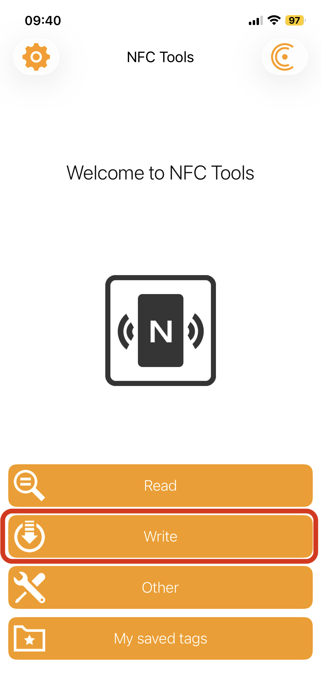
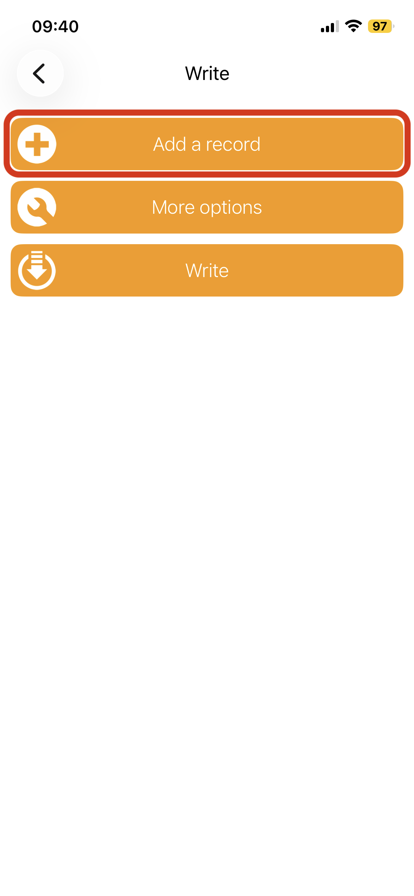
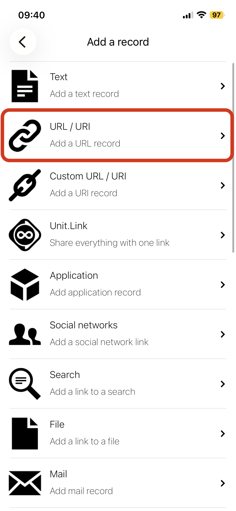
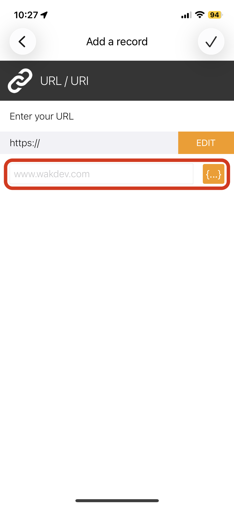
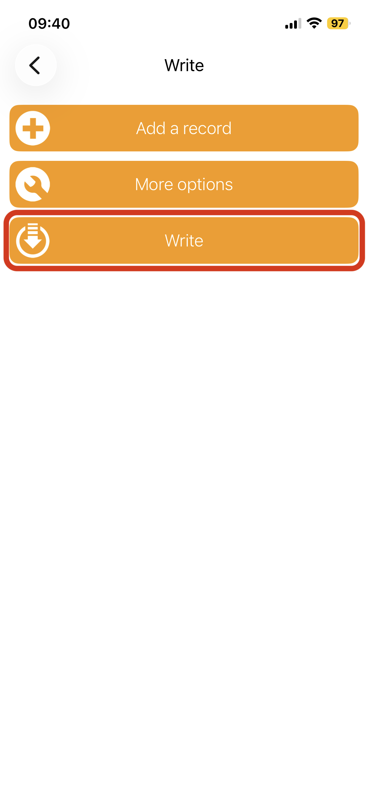

# 3D Printed NFC Resume Keychain

An open-source project that combines **3D printing and NFC technology** to create keychains that instantly open a **resume or LinkedIn profile** when tapped with a smartphone.

The idea came from wanting a **simple way to share my resume and LinkedIn profile at networking events**. Instead of asking someone to type a URL or search for a profile, they can simply **tap the keychain with their phone** and immediately access the information.

This project demonstrates:

- CAD modeling
- 3D printing
- NFC programming
- practical networking tools

---

# Example

---

# How It Works

Inside the 3D printed keychain is a **small NFC tag that is embedded during the printing process**.

When someone taps their phone on the keychain:

- the **resume version** opens a PDF resume
- the **profile version** opens a LinkedIn profile

No app is required on most modern smartphones.

---

# Models

The repository contains two example designs.

### Resume NFC Tag

Cross section from top

Cross section from side

---

### LinkedIn Profile NFC Tag

Top view

Cross section

---

# 3D Printing Instructions

The design includes a **slot inside the print for the NFC tag**.

### Recommended workflow

1. Start printing normally.
2. When the printer reaches the layer where the **NFC cavity is open**, pause the print.
3. Place the NFC tag inside the cavity.
4. Resume the print to seal the tag inside the keychain.

This embeds the NFC tag directly inside the printed part.

---

### Logo Color Change (Optional)

If you want the logo to be a different color:

1. Pause the print when the printer reaches the **logo layer**.
2. Change filament color.
3. Resume the print.

This creates a clean two-color effect without needing a multi-material printer.

---

# Hardware

NFC tags used in this project:

https://www.amazon.com/dp/B087M9FLM4

These are small round NFC stickers that work well for embedded prints because they are:

- thin
- easy to program
- compatible with most smartphones

---

# Programming the NFC Tag

The tags were programmed using the **NFC Tools** mobile app.

### Example workflow

1. Open **NFC Tools** (You can use any NFC writing app)
2. Tap **Write**
3. Tap **Add Record**
4. Select **URL / URI**
5. Paste the desired link
6. Tap **Write**
7. Hold the phone near the NFC tag

### App Screenshots

---

# Files

The `models` folder contains printable files:
models/
LinkedInNFC.stl
LinkedInNFC.3mf
ResumeNFC.stl
ResumeNFC.3mf

- **STL** → universal compatibility  
- **3MF** → modern format with more metadata

---

# Use Cases

Possible applications include:

- resume sharing
- portfolio links
- GitHub profile
- digital business cards
- conference networking
- event badges

---

# Reproducing This Project

1. Download the STL or 3MF files from the `models` folder.
2. Slice the model using your preferred slicer.
3. Add a pause at the layer where the NFC cavity is open.
4. Insert the NFC tag.
5. Resume the print to seal the tag inside the keychain.
6. Program the NFC tag using the NFC Tools app.

---

# License

This project is licensed under the **MIT License**.

---

# Trademark Notice

LinkedIn is a trademark of LinkedIn Corporation.

The LinkedIn name and logo shown in this repository are used only for demonstration purposes in a personal project. This project is not affiliated with, endorsed by, or sponsored by LinkedIn.
